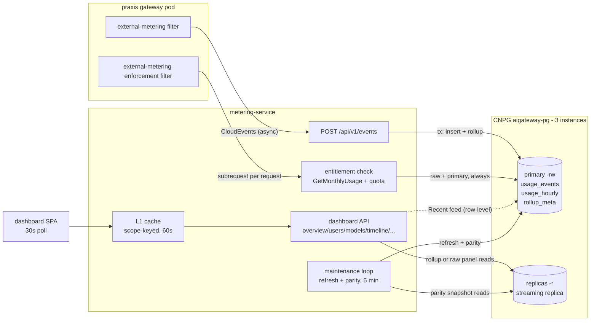
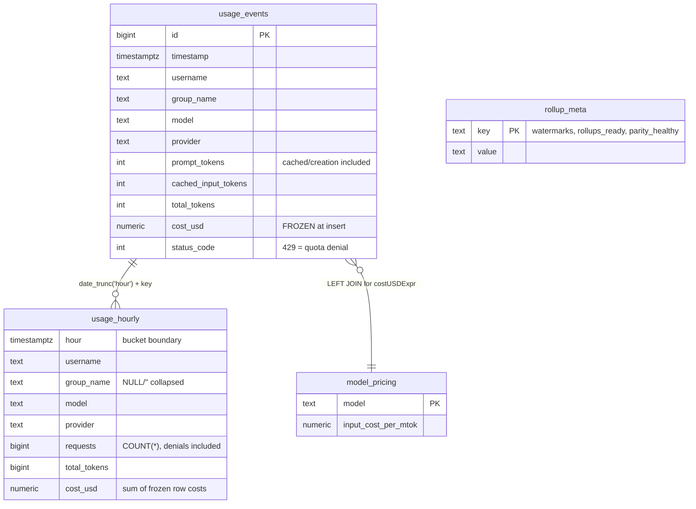
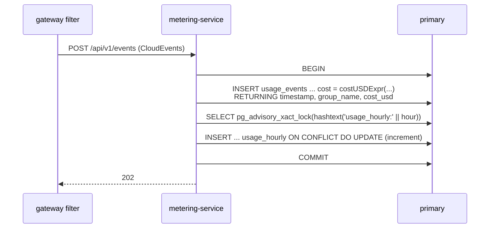
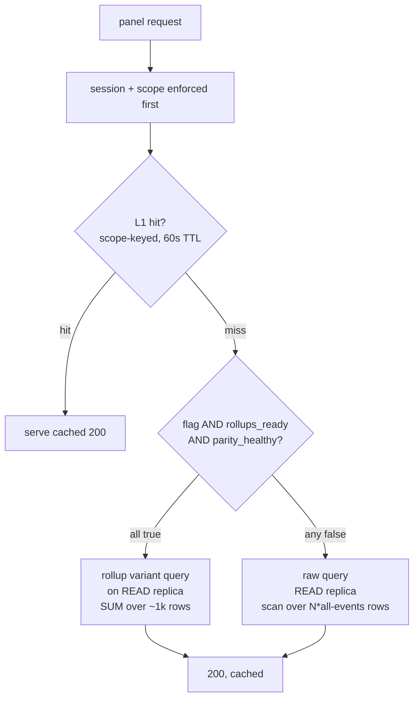

# Dashboard Architecture — ingestion, storage, and the scaling layers

This is the handover document for the metering dashboard's data path:
how an LLM request becomes a dollar figure on a screen, and the four
layers that keep that screen fast as the ledger grows. The historical
plan-of-record (decisions, review threads, revised scope) lives in
[dashboard-scaling-plan.md](dashboard-scaling-plan.md); this document
describes what is actually deployed, with the numbers it measured.

Related: [dogfood-runbook.md](dogfood-runbook.md),
[openshift-deploy-guide.md](openshift-deploy-guide.md),
[../deploy/cnpg/README.md](../deploy/cnpg/README.md) (production
Postgres: CNPG HA, backups, restore),
[../deploy/readonly-replica/README.md](../deploy/readonly-replica/README.md)
(replica role + grants).

## At a glance

A gateway filter reports every LLM call; the service turns it into an
immutable ledger row with its cost frozen at write time, and maintains
an hourly aggregate table transactionally alongside it. Dashboard reads
answered from the aggregate run in ~1 ms and do not grow with the
ledger; reads answered from raw are the automatic fallback, never the
manual one. Every number the aggregate serves is continuously proved
against the ledger by a standing consistency check — when they
disagree, the dashboard silently goes back to raw until they don't.

| Layer | Mechanism | Switch | Failure behavior |
|-------|-----------|--------|------------------|
| L1 response cache | scope-keyed LRU, 60s TTL, behind auth | `DASHBOARD_CACHE_ENABLED` (on) | miss → compute |
| L2 read replica | CNPG `-r` service, `metering_reader` SELECT allowlist | `READ_DATABASE_URL` (set) | falls back to primary |
| L3 hourly rollups | `usage_hourly` upserted in every event transaction | always (writes) | self-healing rebuild |
| L4 read switch | panel queries served from `usage_hourly` | `DASHBOARD_USE_ROLLUPS` (on) | flag off, or auto-fallback on parity red |

## System context

The two deliberate asymmetries: the **entitlement/enforcement path**
always reads raw on the primary (a blocking decision must not rest on a
lagging replica or an aggregate), and the **Recent feed** always reads
row-level detail from the primary — it is the freshness surface ("did
the gateway just block me?") and hourly buckets physically cannot
answer it. Everything else on the read path may use replicas and
rollups.

## Data model

Invariants that everything else rests on:

1. **One cost formula.** `costUSDExpr` (one SQL constant) computes cost
   for the insert, the historical backfill, and the raw side of the
   parity check. CI greps that all three embed the constant itself, so
   editing one path without the others fails the build.
2. **Cost is frozen at write time.** `usage_events.cost_usd` is
   computed once, at insert, from the pricing table as it stood then.
   Editing `model_pricing` no longer rewrites history anywhere. (This
   was a conscious semantic change — the raw path used to re-price at
   every read, so historical spend drifted under catalog edits and
   re-pricing could retroactively change who was "over budget".)
3. **The rollup is in the event's transaction.** Both insert sites —
   gateway events and quota denials (429s bypass `InsertEvent`) —
   upsert `usage_hourly` before committing. There is no async worker
   and no window where a committed event is missing from its bucket.
4. **Raw is the source of truth.** `usage_hourly` is always rebuildable
   from `usage_events` (rebuild = recompute-from-raw overwrite, never
   add — crash-replay safe). Deleting the rollup table loses speed,
   never data.
5. **Denials count in `requests`** everywhere — inserts, rebuild,
   parity — so the count gate can't go red over them.

## Write path

The advisory lock is per hour-bucket (UTC-rendered key) and is held by
**both** writers of a bucket: every live upsert takes it, and every
rebuild/refresh takes its whole hour range, ascending. That closes the
one race the naive design has — a periodic rebuild's aggregate snapshot
committing on top of a live increment it never saw. Deadlock-free by
construction: upserters hold exactly one lock; refreshers take
multi-lock ranges strictly ascending, so no cycle can close. (Verified
live: a second writer blocked 2.0 s on the bucket holder, then
proceeded, no deadlock.)

## Read path

The seven switchable panel readers (overview, groups, users, models,
timeline, team-usage, hosted-savings KPI) each hold **both** variants
of their query as literal text: the raw one is byte-identical to the
pre-rollup path (grep-guarded both directions, because the parity gate
is defined against it), the rollup one is the same shape with three
tokens swapped — source table, window column (`hour`), and cost column
(the stored number instead of the priced expression). Counts come from
`SUM(requests)`, never `COUNT(*)` of bucket rows. The savings
counterfactual CTE has ONE copy of the math, parameterized by source
table.

The three-condition gate is per-request and in-memory (no queries):
`DASHBOARD_USE_ROLLUPS` (operator intent), `rollups_ready` (backfill
complete), `parity_healthy` (the standing proof). Any one false serves
raw. Transitions are logged once, not per request.

## The consistency machine

`RunRollupMaintenance` runs every `ROLLUP_REFRESH_SECONDS` (default
300) **regardless of the read flag** — keeping the table reconciled and
the proof warm is what makes enabling the flag a risk-free flip and
rollback instant:

```mermaid
stateDiagram-v2
    [*] --> Backfill: first boot with empty rollups
    Backfill --> Backfill: cost sweep (id windows)<br/>then hour rebuilds (watermarks, resumable)
    Backfill --> Steady: rollups_ready=true
    Steady --> Steady: every tick: refresh last 3 hours (range lock)<br/>24h parity; 7d hourly
    Steady --> Red: any count mismatch
    Red --> Steady: next green check
    note right of Red: ERROR log (the alert channel)<br/>reads auto-fallback to raw<br/>recovers automatically
```

Parity design decisions, all of them load-bearing:

- **Gate = request counts only.** A count mismatch is impossible under
  the transaction invariant, so it means drift — flip to raw. A *cost*
  difference is expected behavior (frozen vs re-priced after a catalog
  change), so it is logged as a human note, never a red. Auto-falling
  back on cost deltas would keep the table permanently switched off
  after any price edit.
- **One REPEATABLE READ snapshot per report.** Raw and rollup sides run
  as separate queries; on a live replica they could straddle a WAL
  replay boundary and diff every event that replicated in between. The
  invariant only holds within one snapshot.
- **Hour-aligned windows, current hour excluded** from standing checks
  — the in-flight bucket is still moving on both sides; red there would
  be measurement, not drift.
- **Five shapes**, mirroring every switched keying: total, per-model,
  per-group, per-user, per-day. The per-day shape crosses the month
  boundary automatically — the Oct-1 runbook depends on it.
- **Self-healing**: the refresh step rewrites recent hours from raw
  every tick, so benign drift (a missed increment) is repaired within
  one interval, and the recovery is logged.

## Numbers (dogfood, 2026-09-19, 42k-row ledger)

Latency, `EXPLAIN ANALYZE` / client-timed, same session cache warmth:

| Panel query | raw | rollup | speedup | rows scanned |
|---|---|---|---|---|
| overview, 30-day | 19.8 ms | 1.2 ms | **16.5x** | 42,131 + pricing join → 1,076 |
| team usage, ALL TIME | 17.7 ms | 1.0 ms | **17.6x** | 20,008 + join + parallel workers → 1,017 |

Correctness:

| Check | Result |
|---|---|
| 7-day parity (switch gate) | 26,528 req / 3,201,499,015 tok / $558.170178 — **exact both sides** |
| 90-day per-model parity | 38/38 models MATCH on counts, tokens, cost (8-decimal) |
| In-flight hour, live traffic | 62 req / 8,384,341 tok / $0.162598 exact, seconds after insert |
| Hour-lock drill | writer blocked 2.0 s, serialized, no deadlock |
| Fail-safe drills (2 real ones) | broken parity check → raw served throughout; ingest never impacted |

Growth model (Est., from observed 500 events/hr at ~30 users):
raw-side panel scans grow ~4.4M rows/yr and the dashboard polls every
30 s per open tab; the rollup stays at `users × models × 24` rows/day
(≈1k rows today for 18 days of history) — **read cost flat in ledger
size, which is the entire point.** At 100 users the raw overview would
scan ~700k rows/poll; the rollup still scans thousands.

## Operations

| Knob | Values | Effect |
|---|---|---|
| `DASHBOARD_USE_ROLLUPS` | `true` (live) / unset = off | L4 read switch; `oc set env deploy/metering-service DASHBOARD_USE_ROLLUPS-` is the one-knob rollback |
| `ROLLUP_REFRESH_SECONDS` | default 300 | refresh + parity cadence; min 60 s |
| `DASHBOARD_CACHE_ENABLED` / `_TTL_SECONDS` | on / 60 | L1; stats at `/api/v1/admin/cache-stats` |
| `READ_DATABASE_URL` | CNPG `-r` DSN | L2; secret `metering-readonly-db-url`, grants in `deploy/readonly-replica/` |

State endpoint (super-admin): `GET /api/v1/admin/rollups` → `ready`,
`use_rollups`, `parity_healthy`, `serving: raw|rollup`;
`?parity=24h|7d|30d|90d` runs the full report. Alerting = logs:
`ROLLUP PARITY RED` at ERROR. **Oct-1 runbook**: month boundary has
never been crossed by real data — run parity + eyeball MTD panels the
morning of. **Deploy pre-flight** (schema-drift trap): run
`preflight_test.go` against the live schema — it PREPAREs every write,
rollup-read and parity statement and executes nothing; it exists
because `GROUP BY 'total'` shipped once, unexecutable, and only the
first real tick found it.

Ship sequence, for the record: #18 plan → #19 cache → #20 replica →
#21 rollups+backfill+parity (deploy flag-off, parity green in 26 s) →
#24 switch+locks+standing parity → #25 hotfix → #26 replica-grants
codified. Each merged to `main`, built from `main`, prod ≡ main.
