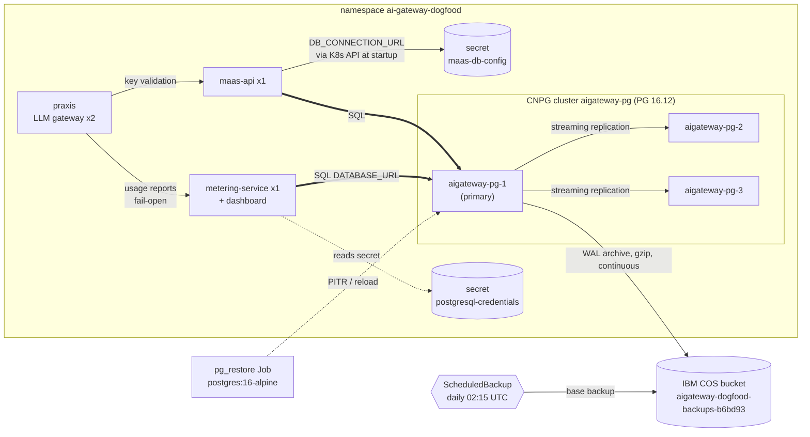
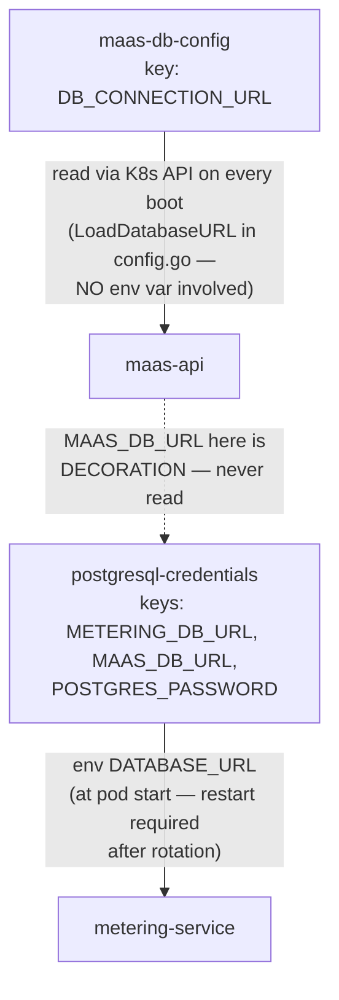
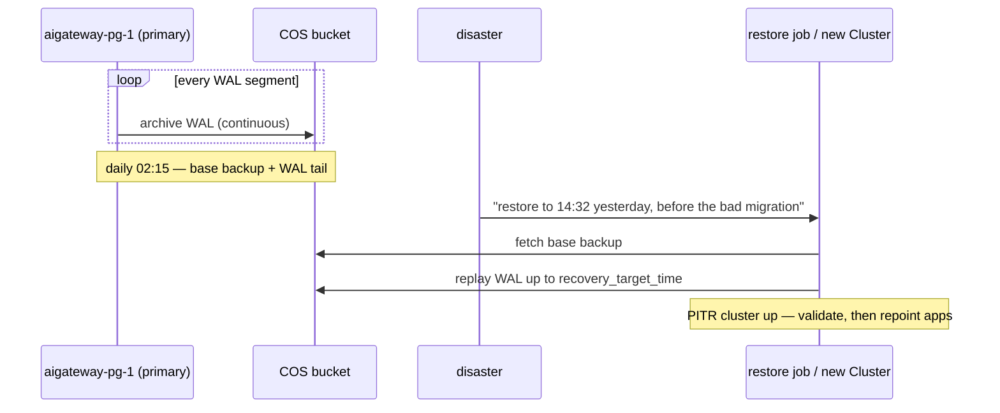

# Database design & the 2026-09-16 CNPG cutover

The `aigateway` PostgreSQL database behind the dogfood PriceTag stack
(namespace `ai-gateway-dogfood`, IBM Cloud OCP, us-south). This document
explains what the database is, how it is architected **today**, who
really talks to it, how it is backed up, and a full record of the
cutover that moved it from a single pod to a highly-available CloudNativePG
cluster — including the two incidents that happened mid-cutover and what
they taught us.

Operational runbook (step-by-step commands): [db-backup.md](db-backup.md).
The manifests discussed here live in `deploy/cnpg/` in this repo
(CNPG cluster, ScheduledBackup, and the cutover/repair/parity jobs —
see `deploy/cnpg/README.md` for what each one is and when it was run).

## What the database holds, and why it must survive

| Data | Written by | Read by |
|---|---|---|
| `usage_events` | `metering-service` (from praxis reports), `maas-api` (key-validation events) | cost dashboards, leader spend reports |
| `api_keys`, `key_invites` | `maas-api` | gateway key validation, onboarding UI |
| `model_pricing` | pricing sync + admin | cost computation for every event |
| `people`, `person_identities`, `user_profiles`, `org_*` | invite/org flows | admin dashboards |
| `schema_migrations`, `visibility_grants` | app bootstrap | app |

The DB is the source for leader-facing cost reporting and for every API
key in the dogfood gateway. Loss is not an option; "restore me to right
before the bad thing last month" is a requirement. That drove the
recovery objectives: **RPO ≈ seconds** (continuous WAL archiving), RTO ≈
a restore-job spin-up, and any point-in-time since the oldest base
backup restorable.

## Current architecture (post-cutover)



Three instances on three separate worker nodes: any pod/node death
triggers automatic failover to a replica (promoted in seconds, apps
reconnect through the `aigateway-pg-rw` service which follows the
primary). Backups never touch the cluster's compute neighbors — WAL and
base backups go straight to IBM Cloud Object Storage with a scoped HMAC
key.

### The secret plumbing (the landmine)

There are **two DSN secrets**, and they behave differently. This bit us
during the cutover: repointing only the "obvious" one left maas-api
silently writing to the old database.



Rules of thumb:

- A cutover or password rotation must patch **both** secrets, then
  `rollout restart` both writers.
- After any repoint, prove no stragglers:
  `SELECT client_addr, count(*) FROM pg_stat_activity WHERE datname='aigateway' GROUP BY 1;`
  on the *old* database must return zero rows.

## Backup & recovery layers

| Layer | Mechanism | Granularity |
|---|---|---|
| Continuous | WAL archiving (gzip, 4 parallel) → COS | seconds of loss max |
| Daily base backup | `ScheduledBackup` 02:15 UTC | restore anchor |
| PITR | `bootstrap.recovery` Cluster pointing at bucket + `recoveryTarget` | any instant since oldest base backup |
| Manual proof | `oc create -f` a `Backup` resource (`backups.postgresql.cnpg.io`) | on-demand |



`backup.barmanObjectStore` is **deprecated in CNPG 1.30 and removed in
1.31** — before upgrading the operator past 1.30.x, migrate to the
Barman Cloud plugin. The bucket/endpoint/HMAC secret all stay.

## The cutover — record of 2026-09-16

Moved `postgresql-0` (single pod, placeholder password, nightly-dump
stopgap) to the CNPG cluster with **zero data loss** and ~1 minute of
writer downtime. praxis — the team-wide LLM gateway, which does not
touch this database — was never scaled.

```mermaid
timeline
    03:22 fresh live dump (no freeze, snapshot-consistent)
    03:24 wipe stale CNPG schema + restore (first load)
    03:27 parity check : 10/11 tables exact, usage_events +35 live drift
    03:28 freeze writers (maas-api + metering-service only)
    03:30 FINAL dump — snapshot taken after writers drained
    03:31 wipe + restore final dump : PARITY OK (11/11 exact)
    03:36 repoint secrets + restart writers : ~50s writer downtime
    03:44 manual base backup to COS — pipeline proven
    03:47 incident #1 caught : maas-api still on old db (second DSN secret)
    03:48 fixed + restarted : old db pg_stat_activity → 0 clients
    03:50 incident #2 caught : repair job inverted-diff duplicated 114 rows
    04:00 repair : delete exact 114-id junk block, backfill real 17 rows
    04:05 containment proof : 0 rows on old missing from CNPG
    04:10 old postgresql-0 scaled to 0 : writers clean, CNPG writes live
```

### Strategy: two snapshots instead of one long freeze

`pg_dump` is snapshot-consistent against a live database, so data
movement needs no freeze at all. The trick to zero loss: an **early
live dump** (validates the whole pipeline while mistakes are free), then
a **~1 minute window** where writers are paused while the *final* dump →
wipe → restore → repoint runs. The DB is under 1 MB, so the whole window
costs less than a minute.

### Verification gates (not vibes)

1. **Per-table `count(*)` parity**, built dynamically from `pg_tables`,
   run by a Job (`deploy/cnpg/35-parity-check-job.yaml`) that queries
   both databases over TCP. `n_live_tup` was never trusted — it is an
   estimate and lies.
2. **Content containment** after the incident repairs: multiset
   diff of every `usage_events` row *by content* (`COPY` both tables
   minus the surrogate id, `awk` count-diff). Final answer: **0** rows
   present on old but missing on CNPG.

### Incident #1 — the second DSN secret

The runbook repointed `postgresql-credentials/MAAS_DB_URL`, which
maas-api **does not read** (see plumbing diagram). Post-restart,
`usage_events` counts showed the old db still growing. Caught within
minutes because we verified counts *after* declaring success, instead of
at the moment of repoint. Fix: patch `maas-db-config/DB_CONNECTION_URL`
too (backed up as `maas-db-config-pre-cnpg` first), restart maas-api,
verify zero connections on the old db. ~10 minutes of leaked
`usage_events` on the old side; recovered in incident #2's backfill.

### Incident #2 — the inverted multiset diff

The backfill script's `awk` counted `new` first and `old` second, so
"rows in old missing from new" actually computed **rows CNPG had more of
than old — its own live rows** — and re-inserted them into CNPG. Two
runs duplicated 114 rows. Detection: the numbers didn't add up (a
"missing" set that grows after backfilling is impossible), plus
consecutive-identical-microsecond timestamp pairs that can only be
copies. Repair was made provable, not heuristic:

- Both bad runs executed while writers were frozen, and a single
  `COPY` consumes consecutive sequence ids — so the junk was exactly one
  contiguous block of 114 ids. Reading the raw id/timestamp window
  confirmed the boundaries unambiguously (monotonic live stream →
  shuffled copies at ids 32852–32965 → monotonic live stream again).
- `DELETE FROM usage_events WHERE id BETWEEN 32852 AND 32965` → `DELETE 114`.
- Then the backfill, direction fixed, inserted the 17 genuinely
  old-only rows. Containment re-verified: 0.

A tempting "lagging timestamp" heuristic would have *deleted real rows*
— live metering reports run minutes behind event time. The lesson is in
the artifact: the bad job YAML is marked **DO-NOT-RUN** with a pointer
to the fixed one, rather than deleted.

## Rollback (insurance, still parked)

The old pod's PVC and both old secrets survive even after
`postgresql-0` was scaled to 0. Status as of 2026-09-18: the planned
one-week warm window (to 2026-09-17) passed with zero incidents, and
the `postgresql` StatefulSet sits `0/0` — not deleted; removing it is a
routine decision, the rewind below is the reason to make that decision
deliberately rather than by cleanup script. Full rewind:

```bash
oc -n ai-gateway-dogfood scale sts postgresql --replicas=1
# repoint from postgresql-credentials-pre-cnpg / maas-db-config-pre-cnpg
# (step 8 of db-backup.md, reversed), restart both writers
```

Rollback forward (new db has writes you want to keep while rewinding)
uses the same content-diff machinery in
`deploy/cnpg/50-repair-usage-events.yaml`, direction flipped.

## Field-verified gotchas

- **OpenShift SCC:** legacy `nonroot` is inert on this IBM cluster —
  `add-scc-to-user` reports success while admission ignores it. Both
  `cnpg-manager` (cnpg-system) and `aigateway-pg-cluster` SAs need
  **`nonroot-v2`**. Instance pods pin uid 26.
- **Fat CRDs** (`clusters`, `poolers`) exceed the 256 KB client-side
  annotation limit: apply with `oc apply --server-side --force-conflicts`.
- **CNPG `s3Credentials` is flat `{name, key}`** — corev1's nested
  `secretKeyRef:` gets silently pruned server-side and archiving dies
  later with "resource name may not be empty".
- **`oc exec` into CNPG pods can't run `psql`**: SCC assigns exec a
  random uid and Postgres peer auth rejects it. Run psql as Jobs that
  read the password from the secret (`valueFrom.secretKeyRef`) and
  connect over TCP.
- **`oc wait backup/...` is ambiguous** on OpenShift (`backups.config.openshift.io`) —
  use `backups.postgresql.cnpg.io`.
- **`usage_events` ids are sparse** (gaps, deletes) — no id threshold can
  separate "rows before X" from "rows after X"; use content diffs.
- **Metering reports lag event time by minutes** (fail-open retries) —
  never infer write-time from event timestamps.
- **praxis is the LLM gateway for the whole team** and does not write to
  this database. It is never in a freeze set, never scaled, never
  restarted for DB work. The DB writer set is exactly
  `maas-api` + `metering-service`.
- Old app DSNs carried a `CHANGE-ME-BEFORE-DEPLOY` placeholder; the
  cutover replaced it with a generated 28-char password, pipe-only
  (generated → secret, never through a terminal or a commit).

## Open items

- COS bucket lifecycle rule (backups currently accumulate forever).
- PITR restore drill against a real `bootstrap.recovery` manifest (read
  the schema from the **installed** CRD — that stanza moved across CNPG
  versions).
- Barman Cloud plugin migration before operator 1.31.
- `sslmode=disable` in app DSNs → `require` + cluster CA.
- After the rollback week: delete the `postgresql` StatefulSet + PVC,
  drop the pre-cnpg secrets and the stopgap CronJob.

## Related

- [db-backup.md](db-backup.md) — the runbook this document diagrams
- `deploy/cnpg/README.md` — operator install (community manifest; the
  OLM listing is EDB's paywalled repackage)
